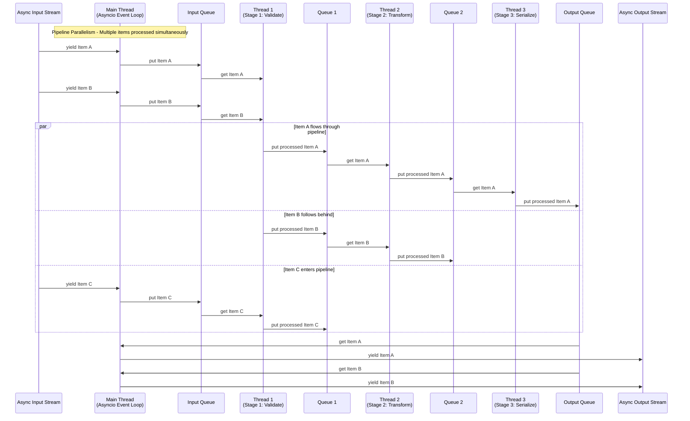

# Async Task Pipeline

A high-performance Python framework for processing streaming data through CPU-intensive tasks using async I/O and thread-based processing.

## Overview

The Async Task Pipeline framework provides a flexible and efficient way to build data processing pipelines that can handle streaming data with CPU-intensive tasks. It combines the benefits of async I/O for handling input/output operations with thread-based processing for CPU-bound computations.

## Key Features

- **Async I/O Integration**: Seamlessly process async iterators and generators
- **Thread-based Processing**: CPU-intensive tasks run in separate threads
- **Performance Monitoring**: Built-in timing and latency analysis
- **Pipeline Composition**: Chain multiple processing stages together
- **Error Handling**: Robust error handling and logging
- **Memory Efficient**: Queue-based processing with configurable limits

## Quick Start

```python
import asyncio
from async_task_pipeline import AsyncTaskPipeline

# Create a pipeline
pipeline = AsyncTaskPipeline(max_queue_size=100, enable_timing=True)

# Add processing stages
pipeline.add_stage("process", lambda x: x * 2)
pipeline.add_stage("filter", lambda x: x if x > 10 else None)

# Start the pipeline
await pipeline.start()

# Process data
async def data_generator():
    for i in range(20):
        yield i
        await asyncio.sleep(0.1)

# Process input stream and collect results
await pipeline.process_input_stream(data_generator())

results = []
async for result in pipeline.generate_output_stream():
    results.append(result)

# Get performance statistics
stats = pipeline.get_latency_summary()
print(f"Processed {stats['total_items']} items")
print(f"Average latency: {stats['avg_total_latency']:.3f}s")

# Stop the pipeline
await pipeline.stop()
```

## Architecture

The framework is built around three main components:

1. **AsyncTaskPipeline**: Main orchestrator that manages stages and data flow
2. **PipelineStage**: Individual processing stages that run in separate threads
3. **PipelineItem**: Data containers that track timing and flow through the pipeline

### Pipeline Workflow

The following diagram illustrates how data flows through the pipeline with parallel processing across multiple stages:



The asyncio event loop handles I/O operations while each pipeline stage runs in its own thread for true CPU parallelism. This design enables:

- **Pipeline Parallelism**: Multiple items can be processed simultaneously at different stages
- **Order Preservation**: Output maintains the same order as input despite parallel processing
- **Async I/O**: Non-blocking input and output operations
- **CPU Efficiency**: True parallelism for CPU-bound tasks through threading

## Use Cases

- **Data Processing**: Transform streaming data with CPU-intensive operations
- **ETL Pipelines**: Extract, transform, and load data with performance monitoring
- **Machine Learning**: Process training data or inference requests
- **Image/Video Processing**: Handle media files with CPU-bound transformations
- **Log Analysis**: Process log streams in real-time

## Installation

```bash
pip install async-task-pipeline
```

## Next Steps

- Check out the [API Reference](api/pipeline.md) for detailed documentation
- Explore the pipeline components: [Pipeline](api/pipeline.md), [Stage](api/stage.md), [Item](api/item.md)
- Learn about [utilities](api/utils.md) for performance analysis and logging
